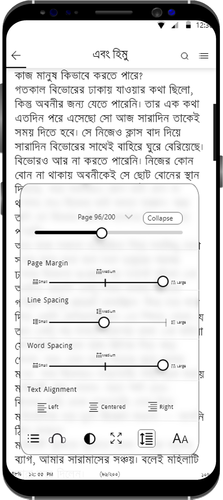

# Boimela
BOIMELA: A Cross-platform E-book app with EPUB 3, MVVM Architecture, OAUTH2.0 API Access Authentication and Content Personalization

[![Contributors][contributors-shield]][contributors-url]
[![Forks][forks-shield]][forks-url]
[![Stargazers][stars-shield]][stars-url]
[![Issues][issues-shield]][issues-url]
[![MIT License][license-shield]][license-url]
[![LinkedIn][linkedin-shield]][linkedin-url]


<!-- PROJECT LOGO -->
<br />
<p align="center">
  <a href="https://github.com/khalid-syfullah/boimela">
    
  </a>
 

  <h3 align="center">Boimela</h3>

  <p align="center">
    BOIMELA: A Cross-platform E-book app with EPUB 3, MVVM Architecture, OAUTH2.0 API Access Authentication and Content Personalization
    <br />
    <a href="https://play.google.com/store/apps/details?id=com.boimelafoundation.boimela"><strong>Download App from Play Store</strong></a>
    <br />
    <br />
    <a href="https://drive.google.com/file/d/149zs7FkKbIcUSxSqJXVpQD0_5V0MFOzO/view?usp=sharing">Documentation</a>
    ·
    <a href="https://forms.gle/BCSpyXMqKeiJeUwP7">Send Review</a>
    ·
    <a href="http://khalidsyfullah.com">Author Page</a>
  </p>
</p>


<!-- TABLE OF CONTENTS -->
<details open="open">
  <summary>Table of Contents</summary>
  <ol>
    <li>
      <a href="#about-the-project">About The Project</a>
      <ul>
        <li><a href="#built-with">Built With</a></li>
        <li><a href="#features">Features</a></li>
      </ul>
    </li>
    <li>
      <a href="#installation">Installation</a></li>
    </li>
    <li><a href="#usage">Usage</a></li>
    <li><a href="#roadmap">Roadmap</a></li>
    <li><a href="#contributing">Contributing</a></li>
    <li><a href="#license">License</a></li>
    <li><a href="#contact">Contact</a></li>
    <li><a href="#acknowledgements">Acknowledgements</a></li>
  </ol>
</details>


<!-- ABOUT THE PROJECT -->
## About The Project

[(Google Drive)](https://drive.google.com/file/d/149zs7FkKbIcUSxSqJXVpQD0_5V0MFOzO/view?usp=sharing)

BOIMELA - An E-Book platform with the EPUB3 standard, MVVM design, OAuthv2.0 API access authentication, and in-app reading customization. This platform can accept E-Books in both the English and Bangla formats.

<br />
<p align="center">
  
  <br>
  <br>
  <br>
  <br>
  
  
  
  <br>
  <br>
  
  
  
  
  <br>
  <br>
  
  
  
  
  <br>
  <br>
  
  
  
  
  <br>
  <br>
  
  
  
  
  <br>
  

  <br>
  <br>
 
  
  <br>
  <br>
  <br>
  <br>
</p>

### Built With

* [Firebase](https://firebase.google.com)
* [Retrofit](https://square.github.io/retrofit/)


### Features
- [x] EPUB3 Compatibility: Supports EPUB3 standard for enhanced e-book features.
- [x] MVVM Architecture: Utilizes MVVM design pattern for organized and scalable app structure.
- [x] OAuth 2.0 API Authentication: Implements OAuth 2.0 for secure API access.
- [x] Multi-language Support: Allows for both English and Bangla user interfaces.
- [x] Chapter Navigation: Enables seamless navigation through e-book chapters.
- [x] Progress Tracking: Monitors and saves e-book reading progress.
- [x] Light and Dark Modes: Provides customizable light and dark reading themes.
- [x] Screen Adjustment: Allows for brightness, contrast, and blue light filter adjustments.
- [x] Page Layout Customization: Offers options to change margin, spacing, and alignment.
- [x] Font Customization: Allows users to adjust font size, family, and color.
- [x] User Management: Supports user registration and administrative privileges.
- [x] Bulk E-book Upload: Enables system admins to upload groups of e-books.
- [x] User Bookshelf: Provides registered users with a customizable bookshelf for easy access.
- [x] Full-screen View: Allows for immersive reading experience in full-screen mode.
- [x] API Security: Ensures current API security standards for data protection.
- [x] In-App Reading Customization: Allows users to customize reading preferences within the app.
- [x] Node.js Backend: Utilizes a Node.js backend to connect the admin panel and mobile app.
- [x] React.js Admin Panel: Provides an intuitive admin panel built with React.js for efficient management.
- [x] Screen Timeout Adjustment: Allows users to adjust the duration before the screen locks during reading.
- [x] Scroll View: Offers both scroll and paginated views for reading convenience.
- [x] Auto Scrolling: Enables automatic scrolling functionality for hands-free reading.
- [x] Volume Button Action: Allows users to customize the action of volume buttons for convenience.
- [x] Word Spacing Adjustment: Provides options to adjust spacing between words for readability.
- [x] Blue Light Filter: Implements a blue light filter to reduce eye strain during night reading sessions.
- [x] Orientation Adjustment: Supports both portrait and landscape orientations for reading comfort.
- [x] API Endpoint Authorization: Implements authorization mechanisms for secure API access.
- [x] Traditional Waterfall Methodology: Follows the traditional waterfall software development lifecycle for systematic development.
- [x] Structural and Creational Design Patterns: Utilizes structural and creational design patterns for efficient code organization and scalability.
- [x] Easy User Administration: Simplifies user administration tasks for system administrators.
- [x] Enhanced E-Book Features: Offers advanced e-book functionalities beyond basic reading capabilities.
- [x] Comprehensive User Interface: Provides a user-friendly interface for seamless navigation and interaction.
- [x] Responsive Design: Ensures the platform is responsive across various devices for optimal user experience.
- [x] Bookmarking: Allows users to bookmark pages for quick access later on.
- [x] Annotation: Enables users to highlight text and add notes for reference.
- [x] Search Functionality: Provides a search feature to quickly locate specific content within e-books.
- [x] Offline Reading: Supports offline reading by allowing users to download e-books for access without an internet connection.
- [x] Cross-Platform Compatibility: Ensures compatibility across multiple platforms such as Android, iOS, and web browsers.
- [x] Interactive Elements: Incorporates interactive elements like multimedia content and hyperlinks within e-books.
- [x] Community Engagement: Facilitates user engagement through features like discussion forums and user reviews.
- [x] Continuous Improvement: Commits to ongoing updates and enhancements based on user feedback and technological advancements.

<p align="center">
  
  <br>
  <br>
  <br>
  <br>
</p>

### Installation

1. Clone the repo
   ```sh
   git clone https://github.com/khalid-syfullah/boimela.git
   ```
2. Download & Install Gradle packages

4. Add dependencies in app `build.gradle` file
   ```Java
   dependencies {
    
    implementation 'androidx.appcompat:appcompat:1.4.1'
    implementation 'com.google.android.material:material:1.5.0'
    implementation 'androidx.constraintlayout:constraintlayout:2.1.3'
    implementation 'androidx.navigation:navigation-fragment:2.4.1'
    implementation 'androidx.navigation:navigation-ui:2.4.1'
    implementation 'androidx.lifecycle:lifecycle-livedata-ktx:2.4.1'
    implementation 'androidx.lifecycle:lifecycle-viewmodel-ktx:2.4.1'
    implementation 'androidx.annotation:annotation:1.3.0'
    implementation platform('com.google.firebase:firebase-bom:29.3.0')
    implementation 'com.google.firebase:firebase-auth:21.0.3'
    testImplementation 'junit:junit:4.13.2'
    androidTestImplementation 'androidx.test.ext:junit:1.1.3'
    androidTestImplementation 'androidx.test.espresso:espresso-core:3.4.0'
    implementation 'com.github.smarteist:autoimageslider:1.4.0'
    implementation 'com.squareup.retrofit2:retrofit:2.5.0'
    implementation 'com.squareup.retrofit2:converter-gson:2.5.0'
    implementation 'com.github.bumptech.glide:glide:4.13.0'
    implementation 'com.squareup.picasso:picasso:2.71828'
    implementation fileTree(dir: 'libs', include: ['*.jar'])
    //implementation files('libs/your jar file.jar')
    api 'tk.zielony:carbon:0.16.0.1'
    implementation 'org.jsoup:jsoup:1.15.2'
    implementation 'com.amulyakhare:com.amulyakhare.textdrawable:1.0.1'
    }

   ```

   <p align="center">
       
       
       
   </p>


<!-- USAGE EXAMPLES -->
## Usage

Use this space to show useful examples of how a project can be used. Additional screenshots, code examples and demos work well in this space. You may also link to more resources.

_For more examples, please refer to the [Documentation](https://drive.google.com/file/d/149zs7FkKbIcUSxSqJXVpQD0_5V0MFOzO/view?usp=sharing)


<!-- ROADMAP -->
## Roadmap

See the [open issues](https://github.com/khalid-syfullah/Boimela/issues) for a list of proposed features (and known issues).


<!-- CONTRIBUTING -->
## Contributing

1. Fork the Project
2. Create your Branch (`git checkout -b khalid-syfullah/Boimela`)
3. Commit your Changes (`git commit -m 'Add some Changes'`)
4. Push to the Branch (`git push origin khalid-syfullah/Boimela`)
5. Open a Pull Request


<!-- LICENSE -->
## License

Distributed under the MIT License. See `LICENSE` for more information.


<!-- CONTACT -->
## Contact

Your Name - [@khalid_syfullah](https://twitter.com/khalid_syfullah) - khalidsyfullah@gmail.com

Project Link: [https://github.com/khalid-syfullah/boimela](https://github.com/khalid-syfullah/boimela)


<!-- ACKNOWLEDGEMENTS -->
## Acknowledgements
* [Choose an Open Source License](https://choosealicense.com)
* [GitHub Pages](https://pages.github.com)

[contributors-shield]: https://img.shields.io/static/v1?label=Contributors&message=2&color=red
[contributors-url]: https://github.com/khalid-syfullah/boimela/graphs/contributors
[forks-shield]: https://img.shields.io/static/v1?label=Forks&message=1&color=green
[forks-url]: https://github.com/khalid-syfullah/boimela/network/members
[stars-shield]: https://img.shields.io/static/v1?label=Stars&message=1&color=blue
[stars-url]: https://github.com/khalid-syfullah/boimela/stargazers
[issues-shield]: https://img.shields.io/static/v1?label=Issues&message=0&color=yellow
[issues-url]: https://github.com/khalid-syfullah/boimela/issues
[license-shield]: https://img.shields.io/static/v1?label=Licenses&message=0&color=purple
[license-url]: https://github.com/khalid-syfullah/boimela/blob/master/LICENSE.txt
[linkedin-shield]: https://img.shields.io/static/v1?label=LinkedIn&message=Khalid-Syfullah&logo=linkedin
[linkedin-url]: https://bd.linkedin.com/in/khalid-syfullah
[product-screenshot]: https://github.com/Khalid-Syfullah/boimela/app/src/main/res/drawable/app_icon.png
